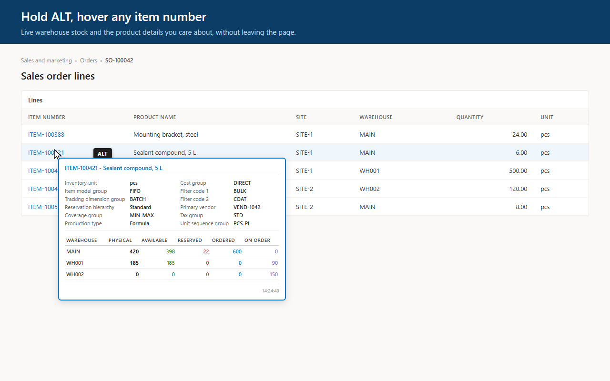

# D365FO Inventory Hover

Hold Alt and hover over an item number anywhere in Dynamics 365 Finance & Operations. A tooltip shows the stock per warehouse and the product details you care about, without leaving the page you're working on.

**[Get it free on Microsoft Edge Add-ons](https://microsoftedge.microsoft.com/addons/detail/d365fo-inventory-hover/kifigmgmdbkjkgogicoglafmceofdahe)** · [Privacy](PRIVACY.md) · [Security](SECURITY.md) · [Changelog](CHANGELOG.md)



## What you get

The tooltip works on sales order lines, formula and BOM lines, loads, and any other page that shows item numbers. It contains:

| Part | Content |
|---|---|
| Header | Item number and product name |
| Product details | Fields from the released product that you choose, such as item model group, tracking dimension group, coverage group or your own extension fields. New installs start with 20 standard fields |
| Stock | One row per warehouse with Physical, Available, Reserved, Ordered and On order. You choose which columns show and in what order |
| Dimensions | Config, Color, Size, Style and Version columns, but only when the item actually uses them |
| Company | A Company column when cross-company mode shows stock from several legal entities |

An item without stock still shows its product details, with a note where the stock table would be.

## Getting started

Install the extension from the [Microsoft Edge Add-ons store](https://microsoftedge.microsoft.com/addons/detail/d365fo-inventory-hover/kifigmgmdbkjkgogicoglafmceofdahe) and pin its icon to the toolbar. There is nothing to configure: it recognises every Microsoft-hosted F&O environment and always works with the environment in the tab you're on.

If your environment runs on an address the extension doesn't know, for example behind a Microsoft Defender for Cloud Apps proxy, open the popup and click **Enable on this site**. See [Supported environments](#supported-environments).

To run it from source in Edge or Chrome, clone this repository, open `edge://extensions` or `chrome://extensions`, turn on Developer mode, click **Load unpacked** and select the repository folder.

## Using it

Hold **Alt** and hover over an item number. You can also hover first and press Alt afterwards. A "Retrieving inventory..." tooltip appears straight away and is replaced by the result a moment later.

The tooltip stays for a second after you move away, so you can move onto it. It stays open while the cursor is on it, and closes when you leave both the item and the tooltip, click elsewhere or switch windows.

Use the complete item number, including any suffix: `FG0010421-01` works, `FG0010421` alone doesn't, because the lookup is an exact match.

**The toolbar popup** holds the day-to-day controls:

| Control | What it does |
|---|---|
| Refresh inventory data | Discards cached lookups in every open D365 tab, so the next hover asks D365 again. Field lists and the query log are kept |
| Cross-company inventory | Switches between the legal entity you are viewing and all legal entities at once |
| Configure tooltip... | Opens the settings page |
| Query statistics | Lookups today and in total. "Today" resets at midnight UTC |
| Recent queries | The last 10 requests. Click one to see the exact OData request and response, with a button to copy both |
| Clear Logs | Empties the query log and counters. Cached lookups are kept, so nothing is queried again |
| Site access | Shown on addresses outside the built-in list, with **Enable on this site** |

Refresh and Clear Logs are separate on purpose: getting fresh data shouldn't erase the request history you may be debugging, and tidying the log shouldn't send every cached item back to D365.

**The settings page** decides what the tooltip shows:

| Setting | What it does |
|---|---|
| Inventory quantities | Show, hide and reorder the five quantity columns. At least one stays visible |
| Product details | Pick an environment, search its fields by label or property name, and click **+** to add one. Reorder with the arrows, remove with ✕, or type over a name to relabel it. Up to 40 fields |
| Restore defaults | Puts back the 20 standard fields |
| Refresh fields | Reads the environment's field list again |
| Hide empty fields | On by default, since a typical released product leaves about half of its 285 fields empty |
| Layout | Two columns (compact) or one column for long values |
| Share this configuration | Copy your field setup as JSON for a colleague, or paste theirs and apply it |

Changes apply to the next hover. Use **Refresh inventory data** for results that are already cached.

## Privacy and trust

This extension runs inside an authenticated F&O session, so you shouldn't have to take its word for anything. Everything below can be checked.

**Why it exists.** It's a personal project by Pieter Willaert, built in free time to stop leaving the page to check stock. It is free and will stay free, with no paid tier, no data collection and no lead generation. If that ever changed, it would be announced and released as a new major version, never slipped into an update.

**Where your data goes.** Only to the D365 environment in your current tab, using the session you are already signed in with, so your D365 security roles apply exactly as they do in the UI. Every request is a read-only `GET` to the page's own address. There is no developer server, no analytics, no telemetry and no remotely loaded code.

**Enforced, not just promised.** A content security policy in `manifest.json` (`connect-src 'none'`) blocks the popup, the settings page and the background worker from making any network request. Only the part running inside the D365 page can make requests, and only to that page's own address.

**Visible.** The popup's **Recent queries** log lists every request with its exact URL and response. Your browser's DevTools show the same.

**Kept locally.** Settings, a five-minute lookup cache, per-environment field lists and the query log stay in your browser profile. [PRIVACY.md](PRIVACY.md) lists each item, how long it is kept and how to clear it.

**Verifiable releases.** Each store package is built reproducibly from a git tag with `scripts/package.js` and published with SHA-256 checksums. `scripts/verify.js` checks that the copy installed in your browser is exactly the tagged source; see [SECURITY.md](SECURITY.md#checking-a-release). If an update ever needs new permissions, your browser disables the extension and asks you first.

**Open source.** MIT licensed. The extension is about 2,700 lines of plain JavaScript plus two HTML pages and a stylesheet, with no build step and no dependencies, so it can be read in an afternoon.

Organisations can pin or restrict extensions with the Microsoft Edge policies `ExtensionSettings`, `ExtensionInstallAllowlist` and `ExtensionInstallForcelist`, or build and distribute a version they have reviewed themselves.

### Permissions

| Permission | Why |
|---|---|
| Host access to the D365 addresses listed below | Run on D365 pages and query the environment you are on |
| `storage` | Settings, the query log, counters, field lists and manually enabled sites |
| `scripting` | Only for **Enable on this site**, to run the extension on an address you approve |
| `activeTab` | Lets the popup see the current tab's address while it is open, to offer **Enable on this site** |
| Optional access to other `https` sites | Grants nothing by itself. Requested per site, through the browser's own permission prompt, when you click **Enable on this site** |

## How it works

### Which company is queried

An OData request without a company is answered for your default company from D365 user options, which is not necessarily the company on screen. After switching legal entity, such a request would quietly return the old company's stock.

So by default the extension reads the company from the `?cmp=` parameter in the page address and scopes every request to it with `cross-company=true` and a `dataAreaId` filter. If the address has no `?cmp=`, it falls back to an unscoped request.

With **Cross-company inventory** switched on, the filter is dropped and the tooltip shows stock from every legal entity, with an "All companies (cross-company)" badge and a Company column whenever more than one company appears. The switch applies to the next hover without a page reload. Cached results are stored per company and mode, so switching never shows a result from a different scope.

### What a lookup does

1. The part of the extension running in the D365 page sees Alt held over a possible item number and checks that the field isn't known to hold something else.
2. It waits 150 ms for the cursor to settle, then checks the five-minute cache.
3. It checks the rate limit: at most 30 lookups per minute. A hover counts once even when it makes two requests, and cache hits don't count. If D365 answers HTTP 429, the extension pauses for as long as `Retry-After` asks, or 30 seconds.
4. It sends two requests at the same time to the page's own address: stock from `WarehousesOnHandV2`, and your chosen fields from `ReleasedProductsV2` (only when fields are selected).
5. It waits for both, so a failed product request never costs you the stock table.
6. It caches the results, writes both to the local query log and shows the tooltip.

The requests run inside the D365 page rather than in the background worker. That is what lets them use your existing sign-in: a request from the background worker would count as cross-site and be refused with HTTP 401.

The requests look like this, where `{item}` is escaped so quotes, slashes and colons can't break the filter:

```
GET /data/WarehousesOnHandV2?cross-company=true&$filter=ItemNumber eq '{item}' and dataAreaId eq '{company}'
GET /data/ReleasedProductsV2?cross-company=true&$top=10&$select=dataAreaId,ItemNumber,{fields}&$filter=ItemNumber eq '{item}' and dataAreaId eq '{company}'
```

In cross-company mode the `dataAreaId` condition is left out. `$select` keeps the product response to a few hundred bytes instead of about 10 KB for a full record.

### Quantity columns

| Column | OData field | Meaning |
|---|---|---|
| Physical | `OnHandQuantity` | Physically on hand, regardless of reservations |
| Available | `AvailableOnHandQuantity` | On hand minus reservations: what's free to use |
| Reserved | `ReservedOnHandQuantity` | Already reserved against stock on hand |
| Ordered | `OrderedQuantity` | Reserved against incoming purchase or production orders |
| On order | `OnOrderQuantity` | On order but not yet received |

Physical and Available can legitimately differ. An item can show 20.8 physical and 0 available when everything on hand is reserved or blocked, so keep Physical visible if "no stock" ever looks wrong.

### Dimension columns

`WarehousesOnHandV2` reports stock per combination of product dimensions, so one warehouse can have several rows. A dimension gets a column as soon as any returned row has a value for it, in D365's order: Config, Color, Size, Style, Version. Most items use none and get no extra columns. Where a column is shown but a row has no value, the cell shows `-`, because stock held with and without a colour is worth telling apart.

### Product fields

The extension ships no fixed field list, because no two implementations have the same one. On the first hover in a tab it reads the list from the environment itself, and keeps it for seven days per environment:

| Step | Request | Purpose |
|---|---|---|
| Probe | `GET /data/ReleasedProductsV2?cross-company=true&$top=1` | Field names and types, from one record. The record's values are used only to infer types and are then discarded |
| Labels | `GET /metadata/PublicEntities(Name='ReleasedProductsV2')` | D365's own labels in your language. Optional: when this API isn't available, labels are derived from the names, so `CTSCustGroup` becomes "CTS Cust Group" |

Because the probe runs with your permissions against your environment, your own extension fields appear automatically and fields you can't access never do. Discovery runs alongside the lookup and never delays a tooltip.

Your field selection is shared by all environments, while each environment keeps its own field list. Before every request the selection is matched against that list, and fields the environment doesn't have are skipped, with a note in the tooltip. Without this, one unknown field in `$select` would make D365 reject the whole request. If that happens anyway, for example before a field list exists, the extension reads the list and retries once. The settings page marks such fields "not in this environment" instead of removing them, because another environment may still need them.

A never-configured install uses the 20 standard fields. A selection you empty on purpose stays empty, and the second request is then not made at all.

Values are shown as follows. Empty strings and D365's "no date" (`1900-01-01`) are hidden while **Hide empty fields** is on, and show as a short placeholder dash when it is off. Other dates and numbers use your locale, and `0` is always shown. Enums such as Yes and No appear as D365 returns them. The `2154-12-31` date is deliberately kept, because in a field like `SellEndDate` it means "no end date".

`ReleasedProductsV2` has no product name field, so the name in the header comes from the stock response. An item without stock therefore shows only its number, unless you add `SearchName` as a field. In cross-company mode the product details come from the company in the page address when there is one, otherwise the first match, labelled with its company.

### Recognising item numbers

A text counts as a possible item number when it matches `/^(?=[A-Z0-9\-_\/:.]*\d)[A-Z0-9][A-Z0-9\-_\/:\.]{2,}$/`: at least three characters, at least one digit, and letters, digits, `-`, `_`, `/`, `:` or `.`. That covers `FG0010421-01`, `RM0020011`, `PACK-PALLET80_DEP` and `SKU/001:A.B`, while codes without digits such as USD, PCS or OPEN are ignored.

Order numbers and warehouse codes can look just like item numbers, so three checks keep lookups on the right fields:

| Check | How |
|---|---|
| Field names | D365 marks form controls with `data-dyn-controlname`. Fields positively identified as something other than an item, such as order numbers, warehouses, batches or statuses, are skipped. Item fields are recognised by `ITEM_FIELD_NAME_PATTERN` in `content.js`. Fields without a control name are treated as possible items |
| The tooltip itself | Values in the tooltip, such as a timestamp, a quantity or a customer ID, can match the pattern too. Hovering the tooltip never triggers a lookup |
| Known shapes | `NON_ITEM_PATTERNS` in `content.js` rejects clock times like `09:41:22`. Add new exceptions there rather than tightening the main pattern, which could reject real item numbers |

## Supported environments

These addresses work out of the box. They follow Microsoft's [published list of geographies](https://learn.microsoft.com/en-us/dynamics365/fin-ops-core/dev-itpro/deployment/deployment-options-geo) and the known naming of development machines:

| Environment | Address pattern |
|---|---|
| Production, United States and global | `*.operations.dynamics.com` |
| Production, Europe, France, Norway, South Africa, Switzerland, UAE | `*.operations.eu.dynamics.com`, `.fr`, `.no`, `.sa`, `.ch`, `.uae` |
| Production, US Government (GCC and GCC High) | `*.operations.gov.microsoftdynamics.us`, `*.operations.high.microsoftdynamics.us` |
| Sandbox and UAT in each of the above | `*.sandbox.operations.<region>...` |
| Cloud-hosted development and demo machines | `*.cloudax.dynamics.com`, `*.axcloud.dynamics.com` |
| OneBox | `*.cloud.onebox.dynamics.com` |

Microsoft's table only shows the US and EU addresses literally; the sandbox addresses for the other regions follow the same documented `sandbox.` convention.

Anything else, such as the DoD cloud, China (operated by 21Vianet), customer-hosted environments or an address rewritten by Microsoft Defender for Cloud Apps (which appends `.mcas.ms`), is enabled with **Enable on this site** in the popup. Your browser asks permission for that exact host only. The extension then runs there immediately and after restarts, and the site is listed in the popup with a **Remove** button that revokes the permission again. Because every request goes to the page's own address, this works through a proxy just like the rest of D365.

To add an address permanently, add its pattern to `host_permissions` and `content_scripts.matches` in `manifest.json`, and to `STATIC_HOST_PATTERNS` in `background.js`.

## Troubleshooting

| Problem | What to check |
|---|---|
| No tooltip | Hold Alt while hovering, and use the full item number. The popup's Recent queries shows whether a lookup ran |
| Tooltip on a field that isn't an item | Look up the field's `data-dyn-controlname` in DevTools and adjust `ITEM_FIELD_NAME_PATTERN` in `content.js` |
| "No inventory records found" although there is stock | Open the lookup in Recent queries to see the exact item number and company that were queried. The stock may be in another legal entity: try cross-company mode |
| Stock from the wrong legal entity | Check in Recent queries that the page address contains `?cmp=` |
| OData error 401 | Your D365 session has probably expired. Reload the D365 tab and sign in again |
| "Too many inventory lookups" | The limit of 30 lookups per minute was reached. Wait a few seconds |
| Results look out of date | Click **Refresh inventory data** in the popup |

## Development

There is no build step and there are no dependencies. The extension is the files in the repository root.

### Tests

The test suites run the real source files in Node, with small stand-ins for `chrome.*` and the DOM:

```
node tests/product-fields.test.js
node tests/hover-detection.test.js
node tests/tooltip-columns.test.js
```

They cover field discovery, value formatting and the product panel; item detection and the tooltip guard, by driving the real `mouseenter` and `keydown` handlers; and the dimension columns. Set `PROJECT_DIR` to an older checkout to watch `hover-detection.test.js` reproduce the bug it guards against.

`RELEASEDPRODUCTSV2.txt` is a sanitised capture of a `ReleasedProductsV2` response, used only by the tests; the extension never reads it. It keeps what the code depends on (all 285 property names including `CTS*` extension fields, the `@odata.etag` annotation, empty values, the null-date sentinel and standard enum values) and replaces every other value with a placeholder such as `ITEM-0001` or `CUST-001`. To sanitise a capture from your own environment, run `node tests/sanitise-fixture.js <raw-capture> RELEASEDPRODUCTSV2.txt`. The script replaces anything that isn't provably a standard enum value and checks that no input value survives.

### Tuning

| Setting | Where |
|---|---|
| Cache lifetime (5 minutes), rate limit (30 per minute) | `content.js` |
| Item number pattern, item field names, rejected shapes | `ITEM_PATTERN`, `ITEM_FIELD_NAME_PATTERN`, `NON_ITEM_PATTERNS` in `content.js` |
| Quantity and dimension columns and their order | `QUANTITY_FIELD_DEFS` (mirrored in `options.js`) and `DIMENSION_FIELD_DEFS` in `content.js` |
| Default fields, field list lifetime (7 days), maximum fields (40) | `DEFAULT_PRODUCT_FIELDS` (mirrored in `options.js` and counted in `popup.js`), `FIELD_CATALOG_TTL`, `MAX_PRODUCT_FIELDS` in `content-product-fields.js` |

Field lists are stored in `chrome.storage.local`, because a 285-field list exceeds the 8 KB item limit of `chrome.storage.sync`. Only your selection and settings sync.

### Releasing

Commit and tag the version, then build the store package from the tag:

```
git tag v1.1.2
node scripts/package.js v1.1.2
```

This writes `dist/d365fo-inventory-hover-<version>.zip` and `dist/SHA256SUMS.txt`, built from git rather than the working folder, so the same tag gives the same bytes on any machine. Upload the zip in [Microsoft Partner Center](https://partner.microsoft.com/dashboard/microsoftedge/overview) and attach both files to the GitHub release. Record the changes in [CHANGELOG.md](CHANGELOG.md).

The `video/` folder holds the source of the promotional video; see [video/README.md](video/README.md).

## License

[MIT](LICENSE) © 2026 Pieter Willaert
